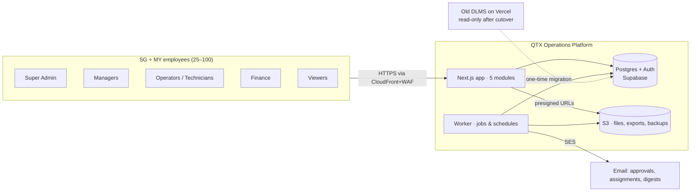
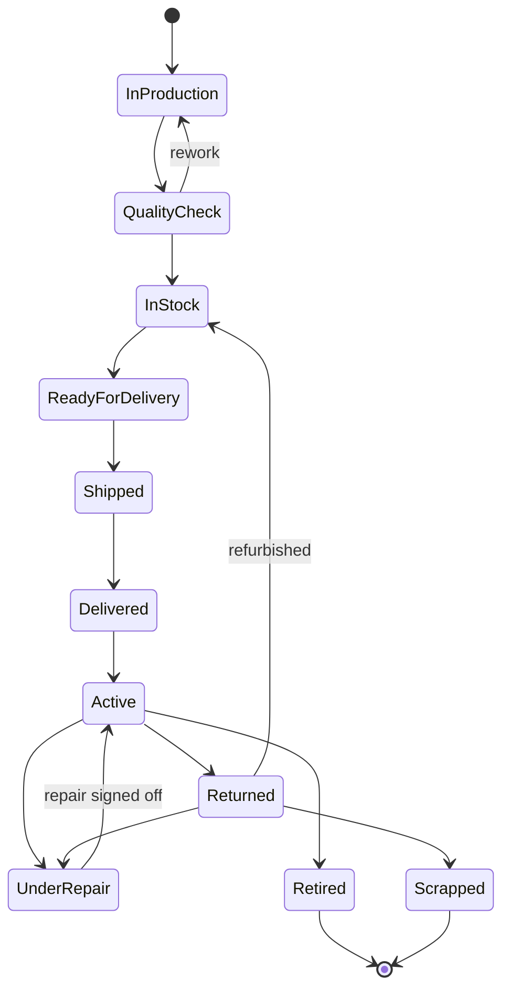
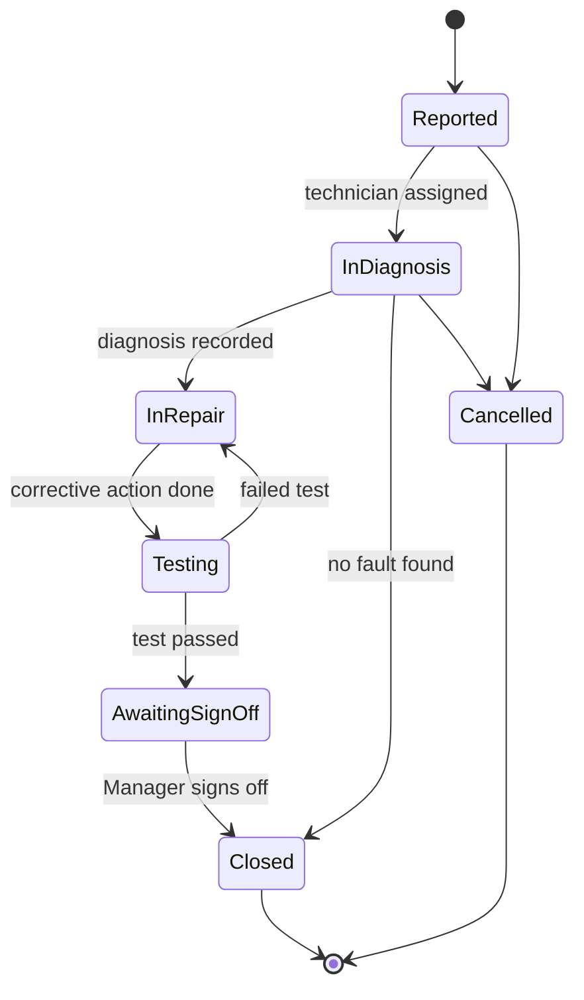
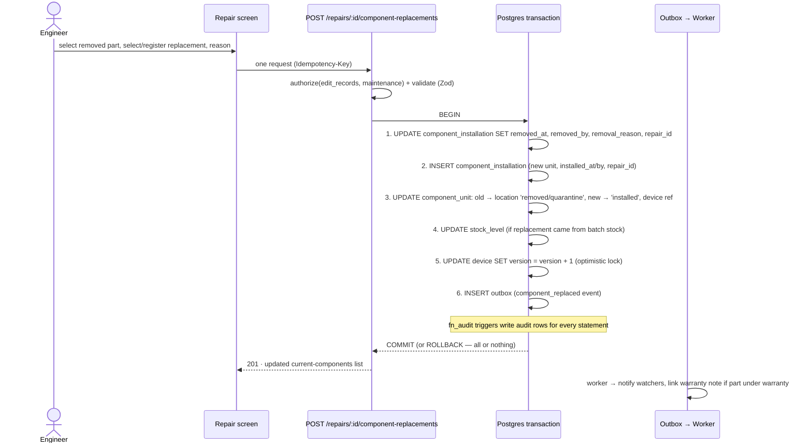
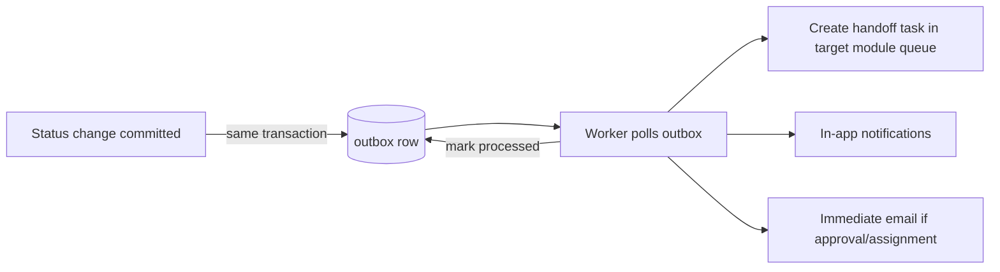
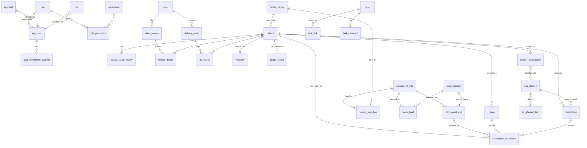
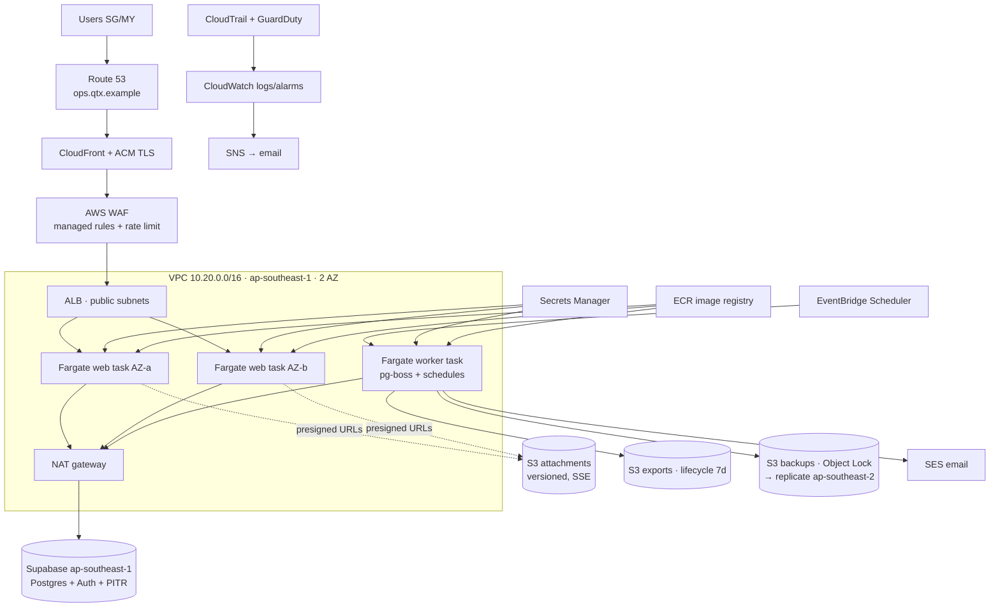

# QTX Operations Platform — Architecture & Implementation Design

| | |
|---|---|
| **Version** | 1.0 |
| **Date** | 2026-07-17 |
| **Author** | Reet Mitra (interview) / Claude (drafting) |
| **Status** | Draft — pending final review |
| **Deadline** | Launch **2026-09-30** · Demo checkpoint **2026-07-31** (shell + Super Admin console + collaborative tasks + 5 module sections) |
| **Scope** | Expansion of DLMS into a five-module operations platform: Engineering, Finance, Logistics, Manufacturing, Maintenance |

Labels used throughout: **[CONFIRMED]** = decided in the 2026-07-17 discovery interview · **[REC]** = recommendation, approved with this doc · **[ASSUME]** = assumption, correct if wrong · **[OPEN]** = still undecided · **[LATER]** = deliberately post-launch.

---

## 1. Executive summary

QTX's DLMS (device lifecycle management system — Next.js 14 + Supabase on Vercel) becomes the **Manufacturing module** of a company-wide operations platform serving 25–100 employees across Singapore and Malaysia. Four new modules — Engineering, Finance, Logistics, Maintenance — share a single device registry, a normalized append-only component-history model, one task system, one approvals engine, and one immutable audit trail.

**Architecture in one paragraph:** a modular-monolith Next.js application (the evolved DLMS codebase: new five-module shell, ported screens) backed by a new dedicated Supabase project (Postgres + Auth), deployed on AWS ap-southeast-1 — ECS Fargate behind ALB + CloudFront + WAF, S3 for all attachments via presigned URLs, SES for email, a Postgres-backed job queue (pg-boss) in a worker service for imports/exports/notifications/scheduled jobs, Terraform for infrastructure. Reads go through supabase-js under live RLS (the proven DLMS pattern); writes go through a direct node-postgres connection so multi-table workflows (component replacement, status handoffs) are real ACID transactions. Migration is a freeze-weekend cutover with total fidelity: device UUIDs, complete audit history, drafts, and presets all survive.

**Why these choices:** one developer (plus AI agents), a US$100–250/mo infra budget, a 99.5% business-hours availability target, and a 10-week runway reward boring, already-hardened patterns over novelty. Every component below either ports a pattern DLMS has proven in production or is the simplest standard tool for the job.

---

## 2. Confirmed requirements

### 2.1 Business requirements [CONFIRMED]

- BR-1: Five modules — Engineering, Finance, Logistics, Manufacturing, Maintenance ("Maintenance" singular everywhere).
- BR-2: All current DLMS functionality moves into Manufacturing; a Devices subsection is the central registry for every manufactured device, keyed by serial number, with Basic/Pro variants (extensible without schema change).
- BR-3: Hybrid access model: role-based everywhere; the Finance module is a hard access boundary; department is an organizational attribute, not a wall. No field-level masking beyond Finance-module gating (a serializer seam is kept so this can tighten later).
- BR-4: Three approval flows: Engineering Change Orders; Finance records ≥ a configurable threshold; repair sign-off (which returns the device to service).
- BR-5: Cross-department handoffs are status-driven: device status changes automatically create tasks in the next department's queue.
- BR-6: Employees only in year 1; auth model shaped for a future customer/supplier portal. English UI; bilingual (EN/中文) free-text data preserved verbatim.
- BR-7: Invoices and delivery orders are structured records with attached official PDFs — the platform does not generate accounting documents and there is no external accounting system to integrate.
- BR-8: Usage tracking starts manual + CSV import on a time-series model; device telemetry can plug in later without remodeling.
- BR-9: Everything retained indefinitely (soft-delete only). Full-system export by Super Admin with fresh MFA re-auth.
- BR-10: Hard deadline: full MVP live 2026-09-30; working demo (shell, Super Admin console, collaborative tasks, five sections) 2026-07-31.

### 2.2 Non-functional requirements

| NFR | Target | Source |
|---|---|---|
| Availability | 99.5% business hours (SGT); maintenance windows off-hours | [CONFIRMED] |
| RTO / RPO | 4 h / 24 h worst case (PITR brings RPO to minutes in practice) | [CONFIRMED] |
| Scale (2 yr) | 100 users, 20 k devices, 500 devices/mo, ~50 concurrent | [CONFIRMED] |
| Latency | p95 < 500 ms reads, < 1 s writes, from SG/MY | [REC] |
| Infra budget | US$100–250/mo all-in (prod + staging) | [CONFIRMED] |
| Security | MFA for privileged roles; server-side authz on every request; immutable audit | [CONFIRMED] |
| Compliance posture | PDPA-aligned (SG/MY): buyer PII access-controlled + audited, data in ap-southeast-1 | [REC] |
| Operability | Runnable by one person; no 24/7 on-call; alarms → email/push | [CONFIRMED] |

### 2.3 Explicitly out of MVP [LATER]

Mobile app · barcode/QR scanning (schema reserves `device_sn` as the scannable key) · device telemetry ingestion API · preventive-maintenance automation · accounting/ERP integration · customer portal · SSO · predictive analytics · offline field mode · purchase records, expenses, device cost rollup (Finance phase 2) · dedicated RMA flow (returns ride on status + repairs) · custom role builder · video/office/log attachments.

---

## 3. Users, roles, and permissions

### 3.1 Role set [CONFIRMED]

Six roles, DB-stored, plus per-user **module access** flags. One role per user; rare per-user permission overrides (grant or revoke, optionally time-boxed) for exceptions. Department is a user attribute used for task routing and dashboards, not access control.

| Role | Intended holders | Summary |
|---|---|---|
| **Super Admin** | Reet + one deputy | Everything, including user/role/permission management, system settings, full audit, full-system export |
| **Admin** | Ops lead | Everything operational except role/permission management, settings, and full export |
| **Manager** | Department managers | View/create/edit in accessible modules + approve, assign, sign off repairs, export, import |
| **Operator** | Engineers, technicians, logistics staff | View/create/edit in accessible modules, change device status, upload/download files, log usage & service |
| **Finance** | Finance staff | Operator abilities within Finance + Logistics modules + view/manage finance records |
| **Viewer** | Executives, read-only stakeholders | View records + dashboards in accessible modules; no edits, no exports |

### 3.2 Permission vocabulary [REC]

24 permissions. Enforcement is **always server-side** at one choke point (`authorize()`, §8.3); the UI merely hides what the API would refuse; RLS mirrors the read rules as defense-in-depth.

| # | Permission | SA | Ad | Mgr | Op | Fin | Vw |
|---|---|---|---|---|---|---|---|
| 1 | `view_records` | ✅ | ✅ | ✅ | ✅ | ✅ | ✅ |
| 2 | `create_records` | ✅ | ✅ | ✅ | ✅ | ✅ | — |
| 3 | `edit_records` | ✅ | ✅ | ✅ | ✅ | ✅ | — |
| 4 | `delete_records` (soft) | ✅ | ✅ | ✅ | — | — | — |
| 5 | `restore_records` | ✅ | ✅ | — | — | — | — |
| 6 | `change_device_status` | ✅ | ✅ | ✅ | ✅ | — | — |
| 7 | `assign_tasks` | ✅ | ✅ | ✅ | ✅ | ✅ | — |
| 8 | `approve_requests` | ✅ | ✅ | ✅ | — | — | — |
| 9 | `sign_off_repairs` | ✅ | ✅ | ✅ | — | — | — |
| 10 | `upload_files` | ✅ | ✅ | ✅ | ✅ | ✅ | — |
| 11 | `download_files` | ✅ | ✅ | ✅ | ✅ | ✅ | ✅ |
| 12 | `export_data` (filtered CSV) | ✅ | ✅ | ✅ | — | ✅ | — |
| 13 | `import_data` | ✅ | ✅ | ✅ | — | — | — |
| 14 | `view_finance` | ✅ | ✅ | ① | — | ✅ | ① |
| 15 | `manage_finance` | ✅ | ✅ | — | — | ✅ | — |
| 16 | `view_buyer_details` | ✅ | ✅ | ✅ | ✅ | ✅ | — |
| 17 | `log_usage_service` | ✅ | ✅ | ✅ | ✅ | — | — |
| 18 | `view_audit_record` (per-record) | ✅ | ✅ | ✅ | ✅ | ✅ | — |
| 19 | `view_full_audit` | ✅ | ✅ | — | — | — | — |
| 20 | `manage_users` | ✅ | — | — | — | — | — |
| 21 | `manage_roles_permissions` | ✅ | — | — | — | — | — |
| 22 | `manage_vocabularies` | ✅ | ✅ | — | — | — | — |
| 23 | `manage_settings` | ✅ | — | — | — | — | — |
| 24 | `request_full_export` | ✅ | — | — | — | — | — |

① Manager/Viewer see Finance records only if granted Finance **module access** (the hybrid boundary, BR-3). Module access is checked before permissions: `authorize()` = module access ∧ role permission ∧ overrides.

### 3.3 Super Admin console [CONFIRMED — July 31 scope]

Register users · invite by email (Supabase Auth invite; magic-link first login → forced password + optional TOTP setup) · activate/deactivate (deactivation revokes all sessions immediately) · reset access (password-reset email, MFA reset with re-verification) · assign department, role, module access · edit role→permission matrix · per-user overrides with reason + optional expiry · view per-user activity (from `audit_log`) · view security events (logins, failures, lockouts, permission denials) · system settings (finance approval threshold, notification defaults, export retention).

Guard rails: the last active Super Admin cannot be deactivated or demoted (ported DLMS "last-admin" pre-read check); role/permission edits are themselves audited; separation of duties — Admins operate, only Super Admins alter the permission fabric.

### 3.4 Temporary and future-external access

Time-boxed access = `user_permission_override.expires_at` (worker sweeps expiries hourly) or account deactivation date. Future portal users [LATER] get a distinct `user_kind = 'external'` on `app_user` with an entirely separate role family — the column exists from day one so the schema never migrates for it.

---

## 4. Module breakdown & information architecture

### 4.1 Navigation [CONFIRMED — July 31 scope]

```
┌────────────────────────────────────────────────────────────────────┐
│  QTX Ops   [Global search ⌘K]              🔔 Notifications  👤 Me │
├──────────────┬─────────────────────────────────────────────────────┤
│ 🏠 Home      │  Home = personal dashboard: My tasks · My approvals │
│ 🔧 Engineering│         · module KPIs the user can see             │
│ 💰 Finance   │                                                     │
│ 🚚 Logistics │  Each module: Dashboard · Records · Tasks ·         │
│ 🏭 Manufacturing│  Approvals (where relevant) · Reports            │
│ 🛠 Maintenance│                                                     │
│ ✅ Tasks     │  Tasks = central task centre (all modules)          │
│ ⚙️ Admin     │  Admin = Super Admin console (role-gated)           │
└──────────────┴─────────────────────────────────────────────────────┘
```

Module sections and their subsections:

| Module | Subsections (MVP) |
|---|---|
| **Manufacturing** | Devices (registry) · Production pipeline (status board) · Import (Excel/PDF-extract drafts — ported) · Vocabularies |
| **Engineering** | Change requests/orders (ECR/ECO) · Failure investigations · Documents · Firmware releases · BOM (per variant) |
| **Finance** | Sales invoices · Buyers · Approval queue |
| **Logistics** | Delivery orders · Stock locations · Transfers · Shipping docs |
| **Maintenance** | Repairs · Usage · Modifications |
| **Tasks** | My tasks · Team/department view · All (permission-filtered) |
| **Admin** | Users · Roles & permissions · Vocabularies · Settings · Audit · Exports |

### 4.2 Single source of truth [CONFIRMED]

The **device record** is the hub. Buyer, invoice, delivery order, warranty, repairs, usage, modifications, ECOs, tasks, and files all reference `device.id` (immutable UUID) — never a copy of its data. The information flow of BR-5:

Manufacturing marks device *Ready for Delivery* → outbox event → task in Logistics queue ("Prepare delivery for SN-123") → Logistics creates the DO, marks *Shipped/Delivered* → task in Finance queue ("Record invoice for DO-456") → Finance records the invoice + buyer + warranty → Maintenance later opens repairs against the same device id → Engineering sees the device's components, failures, and modifications on the same profile. No re-entry of device, buyer, or component data anywhere.

---

## 5. Core workflows

### 5.1 System context



### 5.2 Device lifecycle [CONFIRMED]

Statuses live in the admin-editable `status_option` vocabulary; allowed moves live in `status_transition` (fail-closed: no row = forbidden). Existing prod statuses map: `In Stock` → In Stock, `Under Repair` → Under Repair, `Shipped` → Shipped.



Per-transition metadata (all admin-editable): `requires_reason` (e.g. QC→rework, →Returned, →Scrapped), `task_template` (which handoff task to spawn, e.g. Ready for Delivery → Logistics prep task), `notify_roles`. Terminal transitions (`Retired`, `Scrapped`) require `delete_records`-level permission but **no approval** [CONFIRMED — approval reserved for ECO/finance/repair-sign-off]. Full history in `device_status_history`; the device row carries only the current status for querying.

### 5.3 Repair workflow [CONFIRMED — 6-state]



Rules: opening a repair on an `Active`/`Delivered` device offers the device transition → `Under Repair` in the same action (one confirmation, one transaction). Sign-off (permission 9) requires: all component replacements committed, testing notes present. Sign-off automatically transitions the device `Under Repair → Active` and stamps `signed_off_by/at`. Each state change timestamps for downtime reporting. Warranty coverage is a flag + free-text justification; cost is a nullable SGD amount.

### 5.4 Component replacement — the §14 transaction [CONFIRMED]

The engineer performs **one action** in the repair (or modification) screen; the system fans out. No double entry.



Layer responsibilities: **application** (repair screen collects everything in one form; current components fetched live), **API** (single endpoint owns the workflow; idempotent via key so a retry can't double-insert), **database** (FK integrity, partial unique index "one open installation per slot per device", audit triggers, transaction). It is structurally impossible for a repair to show a replacement the device history doesn't have — they commit together or not at all.

### 5.5 Cross-department handoff (transactional outbox) [REC]



Why outbox instead of firing events after commit: a crash between commit and event send would silently lose a handoff. With the outbox, the event is part of the same transaction; the worker retries until processed. Worst case is a delayed task, never a lost one. Approval flows (ECO, invoice ≥ threshold, repair sign-off) ride the same mechanism: `approval` row + outbox → task in the approver-role queue + notification.

---

## 6. Data architecture

Postgres 15+ (Supabase). Conventions inherited from DLMS and applied to **every** table: `id uuid PK default gen_random_uuid()` (immutable internal identity — business keys like serial/invoice numbers are unique-indexed data, never PKs) · `created_at/created_by/updated_at/updated_by` · soft delete via `deleted_at` (no hard deletes anywhere) · `version int` optimistic-lock counter on user-edited tables · `fn_audit` trigger on all mutable tables · vocabulary tables over enums wherever admins may extend (status, component types, modification types).

### 6.1 Entity-relationship diagram



(`task_link`, `approval`, `file`, `notification`, and `audit_log` attach polymorphically via `entity_type + entity_id` — one mechanism, every record type.)

### 6.2 Core DDL (traceability spine)

```sql
CREATE TABLE device_variant (          -- Basic, Pro, future rows — never schema changes
  id uuid PRIMARY KEY DEFAULT gen_random_uuid(),
  code text NOT NULL UNIQUE,           -- 'basic' | 'pro' | ...
  name text NOT NULL,
  active boolean NOT NULL DEFAULT true,
  created_at timestamptz NOT NULL DEFAULT now()
);

CREATE TABLE device (
  id uuid PRIMARY KEY DEFAULT gen_random_uuid(),   -- survives migration verbatim
  device_sn text,                       -- unique when present (legacy rows may lack it)
  variant_id uuid NOT NULL REFERENCES device_variant(id),
  status text NOT NULL REFERENCES status_option(code),
  phase text REFERENCES phase_option(code),   -- legacy manufacturing phase, ported vocab
  buyer_id uuid REFERENCES buyer(id),   -- set at/after delivery
  build_date date, ship_date date, delivered_date date,
  product_name text, model_no text, destination text,
  remarks text,                         -- bilingual free text, preserved verbatim
  pcba_a_sn_legacy text,                -- DLMS de-facto identity, verbatim (may hold a range/list);
                                        -- superseded by component_installation, never used for new records
  device_sn_normalized text,            -- trigger-maintained, search
  needs_data_review boolean NOT NULL DEFAULT false,  -- legacy ranged-serial flag
  created_at timestamptz NOT NULL DEFAULT now(),
  created_by uuid NOT NULL REFERENCES app_user(id),
  updated_at timestamptz NOT NULL DEFAULT now(),
  updated_by uuid REFERENCES app_user(id),
  deleted_at timestamptz,
  version integer NOT NULL DEFAULT 1
);
CREATE UNIQUE INDEX device_sn_unique ON device(device_sn)
  WHERE device_sn IS NOT NULL AND deleted_at IS NULL;
CREATE INDEX device_status_idx ON device(status) WHERE deleted_at IS NULL;
CREATE INDEX device_variant_idx ON device(variant_id);
CREATE INDEX device_sn_trgm ON device USING gin (device_sn_normalized gin_trgm_ops); -- partial match

CREATE TABLE component_type (          -- admin-managed catalogue [CONFIRMED]
  id uuid PRIMARY KEY DEFAULT gen_random_uuid(),
  code text NOT NULL UNIQUE,           -- 'pcba_a', 'pcba_b', 'hmi_screen', admin-added...
  name text NOT NULL,
  tracking_mode text NOT NULL CHECK (tracking_mode IN ('serialized','batch')),
  requires_firmware boolean NOT NULL DEFAULT false,
  active boolean NOT NULL DEFAULT true,
  sort integer NOT NULL DEFAULT 0
  -- + standard audit columns
);

CREATE TABLE component_unit (          -- one row per physical serialized part
  id uuid PRIMARY KEY DEFAULT gen_random_uuid(),
  component_type_id uuid NOT NULL REFERENCES component_type(id),
  serial_no text NOT NULL,
  hw_rev text, bom_rev text, fw_ver text,        -- legacy free text honoured
  firmware_release_id uuid REFERENCES firmware_release(id),
  supplier text, manufacturer text, manufactured_on date,
  batch_no text, cost_sgd numeric(12,2), condition text,
  location_id uuid REFERENCES stock_location(id), -- NULL when installed/disposed
  disposition text NOT NULL DEFAULT 'in_stock'
    CHECK (disposition IN ('in_stock','installed','removed','quarantine','scrapped')),
  needs_split boolean NOT NULL DEFAULT false      -- legacy "0001 to 0015" rows
  -- + standard audit columns, deleted_at, version
);
CREATE UNIQUE INDEX component_unit_sn ON component_unit(component_type_id, serial_no)
  WHERE deleted_at IS NULL;
CREATE INDEX component_unit_sn_trgm ON component_unit USING gin (serial_no gin_trgm_ops);

CREATE TABLE component_installation (  -- APPEND-ONLY history; the heart of §11/§14
  id uuid PRIMARY KEY DEFAULT gen_random_uuid(),
  device_id uuid NOT NULL REFERENCES device(id),
  component_type_id uuid NOT NULL REFERENCES component_type(id),
  component_unit_id uuid REFERENCES component_unit(id),  -- NULL for batch parts
  batch_no text,                                          -- set for batch parts
  slot_no integer NOT NULL DEFAULT 1,   -- supports BOM qty > 1 of the same type (sensor ×2 = slots 1,2)
  installed_at timestamptz NOT NULL DEFAULT now(),
  installed_by uuid NOT NULL REFERENCES app_user(id),
  removed_at timestamptz,               -- NULL = currently installed
  removed_by uuid REFERENCES app_user(id),
  removal_reason text,
  repair_id uuid REFERENCES repair(id),
  modification_id uuid REFERENCES modification(id),
  notes text,
  CONSTRAINT removal_complete CHECK (
    (removed_at IS NULL) = (removed_by IS NULL))
);
-- one open installation per type+slot per device:
CREATE UNIQUE INDEX one_open_install ON component_installation(device_id, component_type_id, slot_no)
  WHERE removed_at IS NULL;
CREATE INDEX ci_unit_history ON component_installation(component_unit_id, installed_at DESC);
-- Rows are never UPDATEd except to set removed_* once; enforced by trigger fn_installation_guard.

CREATE TABLE device_status_history (
  id uuid PRIMARY KEY DEFAULT gen_random_uuid(),
  device_id uuid NOT NULL REFERENCES device(id),
  from_status text, to_status text NOT NULL,
  reason text,                          -- required per status_transition.requires_reason
  changed_by uuid NOT NULL REFERENCES app_user(id),
  changed_at timestamptz NOT NULL DEFAULT now()
);
CREATE INDEX dsh_device ON device_status_history(device_id, changed_at DESC);

CREATE TABLE status_transition (       -- fail-closed workflow, admin-editable
  from_status text NOT NULL REFERENCES status_option(code),
  to_status   text NOT NULL REFERENCES status_option(code),
  requires_reason boolean NOT NULL DEFAULT false,
  task_template_key text,              -- handoff task to spawn (nullable)
  notify_roles text[],
  PRIMARY KEY (from_status, to_status)
);
```

### 6.3 Full entity inventory

| Table | Purpose · key columns · notable constraints |
|---|---|
| **RBAC & identity** | |
| `app_user` | Person; `auth_user_id` (Supabase Auth FK), email, name, `role_id` FK, `department`, `module_access text[]`, `user_kind` ('employee' now, 'external' later), `active`, `mfa_enrolled`. Never hard-deleted (audit attribution). Last-admin guard on writes. |
| `role` | 6 seeded rows; `key` unique; `is_system` protects seeds from deletion. |
| `permission` | 24 seeded rows; `key` unique. Reference data. |
| `role_permission` | M:N; PK (role_id, permission_id). Super-Admin-editable; audited. |
| `user_permission_override` | user_id, permission_id, `granted boolean`, `reason` (required), `expires_at`. Worker expires hourly. |
| **Vocabularies** | `status_option` (code PK, label, is_initial, is_terminal, sort, active — ported), `phase_option` (ported), `modification_type`, `document_type`. All admin-editable, soft-disable via `active`. |
| **Devices** (§6.2) | `device`, `device_variant`, `device_status_history`, `status_transition`, `component_type`, `component_unit`, `component_installation`, `variant_bom_line` (variant_id, component_type_id, qty, notes — the flat BOM). |
| **Post-sales** | `buyer` (name, contact, email, phone, billing/delivery addresses, country, tax_reg, internal_code; owns many devices), `sales_invoice` (invoice_no unique-when-live, buyer FK, issue_date, currency='SGD', amount+tax numeric(12,2), status: draft→pending_approval→final→paid / void; PDF via `file`), `invoice_device` + `do_device` (M:N joins), `delivery_order` (do_no, buyer, invoice FK, status: planned→dispatched→delivered→confirmed, courier, tracking_no, ship address, POD file, customs-doc files, handover notes), `warranty` (device FK unique, start/end dates, terms; status derived from dates — never stored stale). |
| **Maintenance** | `repair` (ref `REP-2026-0001` via sequence, device FK, 6-state status, priority, reported/started/completed dates, reported_by, technician FK, problem/diagnosis/root_cause/corrective_action, downtime_hours, warranty_covered + note, cost_sgd nullable, internal + customer notes, signed_off_by/at), `usage_record` (device FK, recorded_on, `cumulative_sessions` int ≥ 0, source: manual/import/api, entered_by, note; append-only; latest = max(recorded_on); non-monotonic allowed with warning — counters reset), `modification` (ref `MOD-`, device FK, type vocab, request/completion dates, requested/approved/completed_by, reason, description, prev/new configuration text, eng_change FK, repair FK, cost, sign-off). |
| **Engineering** | `eng_change` (ref `ECR-`/`ECO-`, stage: request→order, title, reason, description, status: draft→submitted→approved→implemented / rejected / cancelled, effectivity_date, effectivity_serial, requested_by), `ec_affected_item` (eng_change FK, component_type/variant FK, disposition), `failure_investigation` (ref `FI-`, device/repair FKs nullable, description, containment, root_cause, corrective_action, status, eng_change FK when escalated), `tech_document` (title, type vocab, current_version_id) + `tech_document_version` (doc FK, version_no, file FK, status: draft→in_review→approved, notes; append-only), `firmware_release` (component_type FK, version, released_on, notes, file FK nullable). |
| **Logistics stock** | `stock_location` (name, site: SG/MY, type: warehouse/shelf/repair-bench), `stock_level` (location, component_type, qty ≥ 0; for batch parts; CHECK + row-lock updates), `stock_transfer` (from/to location, status, initiated_by) + `stock_transfer_line` (component_type, qty | component_unit FK). |
| **Collaboration** | `task` (title, description, status: draft/open/in_progress/blocked/awaiting_approval/completed/cancelled — overdue is computed from due_date, priority: low/normal/high/urgent, due_date, assignee FK nullable, department nullable, created_by, blocked_reason, confidential boolean, parent_task_id for subtasks), `task_link` (task, entity_type, entity_id — devices, repairs, invoices, DOs, ECOs, anything), `task_comment` (append-only, edited_at watermark), `task_attachment` via `file`. Confidential tasks visible to creator + assignee + Admins only. |
| **Platform** | `approval` (entity_type, entity_id, kind: eco/invoice/repair_signoff, requested_by, status: pending/approved/rejected, decided_by/at, decision_note, `snapshot jsonb` — what was approved, immutable), `notification` (user, category, title, body, entity ref, read_at, emailed_at), `notification_pref` (user, category, in_app/email/digest flags), `outbox` (§5.5: aggregate ref, event_type, payload jsonb, processed_at, attempts), `file` (§14 doc section: s3_key unique, bucket, original_name, mime, size_bytes, sha256, uploaded_by, entity ref, scan_status, preview_s3_key), `export_job` (§18), `import_job` + ported `extracted_device_draft`, `filter_preset` (ported), `report_subscriber` (ported), `app_setting` (key PK, value jsonb: finance_approval_threshold_sgd, export_retention_days…), `audit_log` (ported schema + new `ip_address inet`, `session_id`; INSERT-only — no UPDATE/DELETE grants to any role, which is the tamper resistance), `auth_event` (login success/failure, lockout, MFA events, permission denials). |

### 6.4 Integrity & lifecycle rules

- **Referential integrity:** FKs everywhere; `ON DELETE RESTRICT` (soft deletes make cascade moot). Soft-deleted parents render children read-only in the service layer.
- **Optimistic locking:** `version` checked on every UPDATE of `device`, `repair`, `modification`, `eng_change`, `sales_invoice`, `delivery_order`, `task` (ported DLMS pattern); HTTP 409 on mismatch with a friendly merge prompt.
- **Immutable history tables** (`component_installation` post-removal, `device_status_history`, `usage_record`, `task_comment`, `approval` post-decision, `audit_log`, `auth_event`): guarded by triggers rejecting UPDATE/DELETE, plus no SQL grants for mutation.
- **Reference numbers** (`REP-`, `MOD-`, `ECR-`, `FI-`): per-year Postgres sequences, formatted in a trigger — human keys, never PKs.
- **Partitioning/archival:** none at MVP scale [CONFIRMED — keep everything]; `audit_log` gets a BRIN index on `occurred_at`; revisit partitioning at ~10 M rows [LATER].
- **Encryption:** at rest (Supabase AES-256, S3 SSE-S3), in transit (TLS 1.2+ everywhere). No application-level field crypto in MVP [CONFIRMED D12 — no field-level protections beyond Finance gating].

---

## 7. API & backend design

### 7.1 Modular monolith [CONFIRMED]

Microservices were evaluated and rejected: one developer, one database, workflows that *want* shared transactions (§5.4), and a scale ceiling (~50 concurrent users) three orders of magnitude below where service separation pays for its operational cost. The monolith is modular in code, not in deployment:

```
app/(platform)/{engineering,finance,logistics,manufacturing,maintenance,tasks,admin}/   ← routes & pages
app/api/v1/...                       ← REST route handlers (thin: parse → authorize → service)
modules/<module>/domain/             ← pure logic, injectable clock, unit-tested (DLMS discipline)
modules/<module>/services/           ← use-cases; own transaction boundaries
modules/shared/{authz,audit,files,tasks,approvals,notifications,outbox,search}/
lib/db/                              ← node-postgres pool + transaction helper; supabase clients
worker/                              ← pg-boss job handlers + schedules (same image, entrypoint=worker)
```

Module boundary rule (enforced by ESLint import rules): modules may import `shared` and their own code; cross-module calls go through the other module's service interface, never its tables directly. This keeps a future extraction possible without believing in it now.

### 7.2 Data access topology [REC — evolves the DLMS pattern]

| Path | Client | Enforcement |
|---|---|---|
| Reads (lists, detail pages, search) | supabase-js server client with user JWT | **RLS live** (ported pattern) + `authorize()` |
| Writes & read-feeds-write pre-checks | node-postgres pool (Supavisor, port 6543) | `authorize()` + real `BEGIN/COMMIT` transactions |
| Auth | Supabase Auth (@supabase/ssr cookies) | MFA (TOTP) enforced for SA/Admin/Finance at login via AAL check |

This keeps DLMS's hardened "RLS-on-reads / privileged-writes" split while fixing its one structural gap: supabase-js writes couldn't span transactions. The pg pool is the platform's biggest novel pattern → validated by a week-1 spike (task: replicate the §5.4 transaction end-to-end with a rollback test).

### 7.3 API conventions

- **REST, versioned at `/api/v1`** (GraphQL rejected: one first-party client, permission filtering is simpler to audit in REST).
- **Validation:** Zod schemas at every handler edge; schemas shared with the frontend forms; OpenAPI generated from Zod for documentation.
- **Errors:** RFC 7807 `application/problem+json` — `{type, title, status, detail, instance, request_id}`; 401/403/404/409/422/429 used precisely; 403 never leaks whether the record exists (404 for unauthorized reads of specific ids).
- **Pagination:** keyset (cursor) on `created_at,id` for all lists; `?limit=50&cursor=…`; total counts only where a dashboard needs them.
- **Filtering/sorting:** whitelisted fields per endpoint (`?status=in_repair&variant=pro&sort=-created_at`); free text via `?q=` hitting normalized/trgm columns.
- **Idempotency:** `Idempotency-Key` header honoured on all mutating workflow endpoints (stored 24 h in a keys table; replay returns the original response).
- **Concurrency:** `If-Match: <version>` (or body `version`) on updates → 409 on stale.
- **Rate limiting:** WAF rate rule (coarse, per-IP) + per-user token bucket in app for expensive endpoints (search, export, import).
- **Tracing/logging:** `request_id` (ULID) issued at CloudFront, propagated through logs (pino structured JSON) and problem responses.
- **Background jobs:** pg-boss queues — `imports`, `exports`, `notifications`, `previews`, `outbox`, `scheduled` (cron: hourly override-expiry sweep, nightly backup dump, warranty radar, daily digest 08:00 SGT).
- **Webhooks:** none in MVP [LATER — telemetry ingestion].

### 7.4 Example endpoints

```
POST /api/v1/devices/{deviceId}/status-changes
  → authorize(change_device_status, manufacturing)
  Body: { "to_status": "ready_for_delivery", "reason": null, "version": 7 }
  201: { "device_id": "…", "from": "in_stock", "to": "ready_for_delivery",
         "changed_at": "…", "spawned_tasks": [{"id":"…","title":"Prepare delivery — SN QTX-P-00412",
         "module":"logistics"}] }
  409: stale version · 422: transition not allowed ("in_stock → delivered is not permitted")

POST /api/v1/repairs/{repairId}/component-replacements     (§5.4 — Idempotency-Key required)
  Body: { "removed_installation_id": "…", "reason": "PCBA-A no power output",
          "replacement": { "component_unit_id": "…" }          // or "new_unit": {serial_no, …}
        }
  201: { "closed_installation": {…}, "new_installation": {…},
         "device_current_components": [ … ] }

POST /api/v1/approvals/{approvalId}/decision
  → authorize(approve_requests) + approver ≠ requester (separation of duties)
  Body: { "decision": "approved", "note": "Threshold OK, PO attached" }
  200: { "status": "approved", "entity": {"type":"sales_invoice","id":"…","new_status":"final"} }

GET  /api/v1/search?q=EE-02A-2603&types=device,component,repair
  200: { "results": { "devices": [...], "components": [...], "repairs": [...] } }
  — every hit passes authorize(view_records, <module>); Finance records absent without access.

POST /api/v1/admin/exports          (full-system export)
  → authorize(request_full_export) + header X-Reauth-Token from a fresh MFA challenge (≤5 min old)
  202: { "job_id": "…", "status": "queued" }   → notification + presigned link when built
```

### 7.5 Transaction boundaries (the ones that matter)

| Workflow | One transaction contains |
|---|---|
| Component replacement | §5.4 steps 1–6 |
| Status change | history row + device row + outbox + (reason validation) |
| Repair sign-off | repair status + signed_off_* + device status change (+history+outbox) |
| Approval decision | approval row + target-record status flip + outbox |
| Invoice finalize ≥ threshold | invoice → pending_approval + approval row + outbox |
| Import confirm (per draft row) | draft → device/units/installations + audit (row-level, resumable batch) |

---

## 8. Frontend & UX

### 8.1 Structure

Next.js App Router; server components for data-heavy lists; client components for forms/interactions. Ported DLMS building blocks: virtualized device table, filter bar + saved presets, draft-confirm import UI, audit timeline, vocabulary admin. New shared components: `EntityTable` (keyset pagination, column presets), `TaskPanel` (rendered on every record page), `ApprovalBanner`, `FileDropzone` (presigned upload, progress, type/size validation client-side too), `StatusPill` + `StatusChangeDialog` (transition-aware: only legal targets offered, reason field when required), `ActivityTimeline` (audit + comments merged), `ConfirmDestructive` (typed confirmation for soft-delete/terminal transitions).

States: every list has loading skeletons, empty states with a primary action, and error states with `request_id` shown for support. Accessibility: WCAG 2.1 AA intent — full keyboard nav, focus management in dialogs, labels/aria on all inputs, contrast-checked palette, no color-only status signaling (pills carry text).

### 8.2 Device profile page [CONFIRMED — tabbed]

Header (always visible): SN · variant badge · current status pill (+ change action) · buyer · warranty state · quick actions (New task, New repair, Log usage). Tabs:

1. **Overview** — key fields, current components summary, latest activity, open tasks/repairs
2. **Components** — current installations table + full history (install/remove/by/reason/linked record); "Replace component" launches the §5.4 flow scoped to a repair/modification
3. **Status history** — timeline with reasons and actors
4. **Post-sales** — buyer, delivery order(s), invoice(s), warranty, handover notes
5. **Usage** — cumulative counter, sparkline, entries with source; "Log reading" inline
6. **Repairs** / 7. **Modifications** — filtered lists + create
8. **Engineering** — ECOs affecting this device (via effectivity/retrofit), failure investigations
9. **Tasks** — linked tasks panel (create in place)
10. **Files** — all attachments across the record, grouped by source
11. **Audit** — per-record `fn_audit` trail (permission 18)

### 8.3 Collaborative tasks [CONFIRMED — July 31 scope]

Create/edit (title, description, priority, due date, assignee or department, confidential flag) · subtasks · comments · file attachments · links to any record (typed picker: device SN, repair ref, invoice no…) · status flow with blocked + blocker reason · reassignment (audited) · My tasks (Home), module Task tabs (auto-filtered by linked-record module), central Tasks section, per-record TaskPanel · filters: person/department/status/priority/due/linked-type · reminders: due-tomorrow and overdue notifications (worker daily sweep) · full history via audit. Permission model: tasks visible to all authenticated users **except** confidential ones (creator, assignee, Admin+) and tasks linked to Finance records (require Finance module access) — link-derived confidentiality is computed at query time through the `authorize()` filter, so search/autocomplete can't leak them.

### 8.4 Global search

`⌘K` palette + header field → `/api/v1/search`: exact + prefix + trigram partial across device SNs, component SNs, buyer names, invoice/DO numbers, repair/mod/ECR/FI refs, task titles, document titles, user names (admin). Grouped results, keyboard-navigable, every group permission-filtered server-side. Postgres `pg_trgm` + normalized columns — no OpenSearch at this scale [CONFIRMED D3].

### 8.5 Dashboards [CONFIRMED — all four widget sets]

- **Home (everyone):** My tasks + overdue · my approvals pending · recent activity on my records
- **Manufacturing:** devices by status (pipeline funnel) & by variant · imports awaiting confirm
- **Maintenance:** active repairs by state with days-in-state aging · repairs by root cause (30/90 d)
- **Logistics/Finance:** deliveries due this week · warranties expiring 30/60/90 d · invoices pending approval / unpaid
- **Admin:** user activity, failed logins, job-queue health, backup status

Implementation: materialized-view-free — direct indexed queries with 60 s server cache; the ported `stats_daily` pattern only if a query proves slow. Reports = the same queries with CSV export (permission 12).

---

## 9. AWS architecture

### 9.1 Diagram



### 9.2 Service choices (and rejections)

| Service | Role | Why / why not alternatives |
|---|---|---|
| ECS Fargate | web ×2 (0.25 vCPU/512 MB, auto-scale to 4 on CPU>70%), worker ×1 | [CONFIRMED] Boring containers; no EKS (K8s tax unjustifiable solo), no EC2 (patching burden), no Lambda for the app (cold starts, 15-min cap vs exports) |
| ALB | routing, health checks (`/api/health`), AZ redundancy | API Gateway rejected: ALB is cheaper at steady traffic and Next.js wants plain HTTP |
| CloudFront + WAF | TLS edge, static asset cache, managed OWASP rules, per-IP rate limiting | Fronts everything; S3 assets via OAC |
| Route 53 + ACM | DNS + free auto-renewing certs | — |
| S3 ×3 buckets | attachments (versioned), exports (7-day lifecycle), backups (Object Lock COMPLIANCE 35 d + cross-region replication) | All private, TLS-only bucket policies, access-logged |
| SES | approvals/assignments/digest email | Production access requested week 1 (sandbox exit lead time) |
| EventBridge Scheduler | fires worker HTTP/task schedules | Replaces cron ambiguity; pg-boss handles in-DB scheduling detail |
| Secrets Manager | DB URLs, Supabase service key, SES creds | Rotation on the service key quarterly (runbook) |
| ECR, CloudWatch, CloudTrail, GuardDuty, SNS | images · logs/metrics/alarms · API audit · threat detection · alert fan-out | Security Hub/Config/Inspector [LATER] — GuardDuty+CloudTrail is the right floor for this size |
| **Not used** | EKS, EC2, RDS/Aurora (D32: Supabase retained; exit path = pg_dump → RDS, ~1 day), ElastiCache (no cache need), OpenSearch (pg_trgm suffices), Cognito (D32), Step Functions/SQS (pg-boss suffices) | Every omission is a service that can't page you |

### 9.3 Environments & network

- **prod** and **staging** as separate AWS accounts under one Organization (blast-radius isolation, per-account cost visibility); staging = same Terraform with small sizes (web ×1, no cross-region replication) + its own free-tier Supabase project with masked seed data (no real buyer PII outside prod — [REC] PDPA hygiene). **dev** = local (`next dev` + local Postgres/Supabase CLI).
- VPC: 2 AZ; public subnets (ALB, NAT), private subnets (Fargate). Security groups: ALB→web :3000 only; web/worker egress 443 + 6543 (Supabase) only. No inbound to tasks. Supabase network restrictions pinned to the NAT EIP.
- **Cost estimate (prod+staging):** Fargate ~$40 · ALB ~$25 · NAT ~$35 · CloudFront/WAF ~$18 · S3 ~$8 · CloudWatch ~$12 · Route53/SES/Secrets ~$6 · Supabase Pro + PITR ~$35 · staging ~$45 ⇒ **≈ US$210–230/mo** — inside D34's $100–250 envelope, with the NAT gateway the first thing to swap (fck-nat instance, −$30) if budget tightens.

---

## 10. File & attachment storage

Flow: client asks API for upload grant → API runs `authorize(upload_files)` + validates declared MIME/size → returns presigned `PUT` (60 s TTL) to `attachments/{entity_type}/{entity_id}/{file_uuid}/{safe_name}` → client uploads directly to S3 → client confirms → API verifies object (HEAD + magic-byte sniff via ranged GET), computes/stores sha256, creates `file` row, enqueues HEIC→JPEG preview job. Downloads always mint per-request presigned GETs (5 min) **after** a permission check on the owning record — no public objects, no long-lived URLs, every grant audit-logged.

Rules [CONFIRMED D26]: JPEG/PNG/HEIC/PDF only; 25 MB/file; 20 files per record (settings-tunable); duplicate detection by sha256 (same record → rejected as duplicate, cross-record → allowed, storage-deduped later if it matters). Versioning on the bucket = deletion recovery (soft-delete the `file` row; object survives). Lifecycle: attachments → Infrequent Access after 90 d. Malware scanning: **[OPEN → accepted risk at MVP]** magic-byte + extension + size validation only; images/PDF-only cap plus internal-users-only materially limits exposure; ClamAV scan-on-upload container is the post-MVP fix (risk register R-10).

---

## 11. Security architecture & threat model

### 11.1 Controls by layer

- **Identity:** Supabase Auth; bcrypt-hashed passwords, min-12 + zxcvbn strength meter; TOTP MFA enforced at login for Super Admin/Admin/Finance (AAL2 check in middleware), opt-in otherwise [CONFIRMED D35]; lockout 10 failures/15 min (+WAF rate rule); httpOnly SameSite=Lax secure cookies via @supabase/ssr; access token 1 h, refresh rotation enabled, absolute session cap 12 h for privileged roles; deactivation = `active=false` + Auth admin sign-out (all sessions die ≤ request time); offboarding runbook (deactivate → reassign open tasks → transfer report subscriptions).
- **Authorization:** single `authorize(user, permission, module, record?)` in every handler (403/404 discipline per §7.3); RLS on all tables as second layer (read policies mirror the matrix; Finance tables demand module access; write grants only to the pooled service identity); IDOR impossible-by-construction: all list/read queries run under user JWT + RLS, all id-addressed reads re-check ownership/module; privilege escalation blocked: role changes only via `manage_users`/`manage_roles_permissions`, self-role-change forbidden, last-Super-Admin guard, permission-fabric edits audited + notified to all Super Admins.
- **Application:** parameterized queries only (node-postgres + supabase-js — no string SQL; ESLint rule bans template-literal SQL); React output encoding + CSP (`default-src 'self'`; S3 attachment host for img/media; no unsafe-inline scripts); CSRF: SameSite cookies + origin check middleware on mutations; secure headers (HSTS preload, nosniff, frame-deny, referrer-policy) at CloudFront + app; Zod at every edge; upload pipeline §10; dependency scanning (npm audit + Renovate weekly), secret scanning (gitleaks in CI), SAST (ESLint security plugins + Semgrep CI), container scan (ECR scan-on-push); pen test [CONFIRMED — pre-launch week 10, external tool-assisted pass + checklist, full third-party engagement LATER].
- **Data:** TLS 1.2+ everywhere (Supabase `sslmode=require`); AES-256 at rest (Supabase/S3); KMS default keys (customer-managed keys add rotation ceremony without threat-model payoff here); least-privilege IAM (task roles scoped to exact bucket prefixes; no wildcard actions); staging data masked [REC §9.3]; export controls §12; secure deletion = soft-delete + (on legal request) crypto-erase via key deletion [LATER].
- **Monitoring:** `auth_event` table (logins, failures, lockouts, MFA changes, permission denials) surfaced in Admin console; CloudTrail (org-wide), GuardDuty findings → SNS email; CloudWatch alarms §13; suspicious-login heuristic (new IP country for privileged user → email the user + Super Admin) [REC, worker job]; incident runbook: contain (deactivate user/rotate secret) → assess (audit_log + CloudTrail) → recover (restore point if data damaged) → review.

### 11.2 Threat model

| Threat | Asset | Path | Controls | Residual |
|---|---|---|---|---|
| Privileged session hijack | Everything | Stolen laptop/token | MFA @ login, 12 h cap, revocation, re-auth for export | Medium-low: in-window token theft → short TTLs |
| Insider over-reach | Buyer PII, finance | Curious employee | Module gating, audit trail, export perms, search filtering | Low; D12 accepts costs visible to record-viewers |
| IDOR / URL guessing | Any record | id enumeration | RLS + authorize on every read, 404-not-403, UUIDs | Very low |
| Privilege escalation | Permission fabric | Compromised Admin | SA-only fabric edits, self-change ban, last-SA guard, audited+notified | Low |
| Malicious upload | Users, infra | Crafted file | Type/size/magic validation, images+PDF only, no inline exec, CSP, presigned-only | Medium-low until ClamAV (R-10) |
| Data exfiltration via export | Whole DB | Rogue/compromised SA | Fresh-MFA re-auth, async + notification to all SAs, audit, 7-day expiry, encrypted ZIP | Low-medium: a true rogue SA is a governance problem |
| Backup theft | Whole DB | S3 compromise | Private+locked buckets, Object Lock, IAM least-priv, GuardDuty | Low |
| Supply chain | App integrity | Poisoned dependency | Renovate+audit gate, lockfile, minimal deps, ECR scan | Medium — industry-wide residual |
| Ransomware/data destruction | DB, S3 | Compromised creds | PITR, Object Lock (immutable 35 d), cross-region copies, restore drills | Low |
| Availability (AZ/Supabase outage) | Service | Cloud incident | Multi-AZ web, 99.5% target accepts brief outage, DR restore path §12 | Accepted per D31 |

---

## 12. Backups, restore, DR & full-system export

**Four distinct mechanisms** [CONFIRMED]:

1. **Operational backups:** Supabase PITR (WAL, RPO≈minutes, 7-day window) — the "oops" recovery for bad deploys/deletes.
2. **DR backups:** nightly `pg_dump -Fc` (02:00 SGT worker job) → `s3://qtx-ops-backups/pg/YYYY/MM/DD/` (versioned, **Object Lock COMPLIANCE 35 days** — immutable even to root) → same-day replication to ap-southeast-2. Retention: 30 nightlies, 12 weekly (Sunday), 12 monthly. S3 attachments: versioning + replication continuously. Survives Supabase-the-company, region loss, and ransomware.
3. **Long-term archival:** monthly dumps → Glacier Deep Archive after 90 d, kept indefinitely (D37).
4. **User-requested exports:** below.

**Restore procedure (runbook `RB-01`):** scenario A (bad data change) — PITR to timestamp, or surgical restore of affected tables from PITR fork; scenario B (Supabase project loss) — create project → `pg_restore` latest dump → repoint Secrets Manager DB URLs → redeploy tasks → verify health + spot-checks (target: within RTO 4 h); scenario C (region loss) — same from ap-southeast-2 replicas. **Restore test: monthly**, scripted (`make dr-test`): restore latest dump into a scratch database, run row-count + checksum reconciliation against prod counts, log result to `backup_verification`; failure alarms. Backup-job failure or missed-object alarms → SNS email same hour.

**Full-system export** [CONFIRMED D36]: Super Admin + fresh MFA (§7.4) → worker builds: one CSV per major entity (RFC 4180, UTF-8-BOM) + JSON for nested/history sets (installations, status history, audit extract) + `manifest.json` (export id, timestamps, app + schema versions, row counts, sha256 per file) + `schema.md` + `relationships.md` (stable-UUID join documentation) + `attachments/` tree + `README.md` → single ZIP, AES-256 (7z) with a passphrase generated per export and **delivered separately** (shown once in-app, never emailed beside the link) → `s3://qtx-ops-exports/{job}/` (SSE, lifecycle-deleted day 7). Requester + all Super Admins notified; request, build, download each audit-logged; failed builds resumable per-entity. CSV+JSON+ZIP chosen over single-CSV (relational fidelity) and SQL dump (not analyst-readable) — sensitive fields included, because the requester ceremony is the control, not field redaction [CONFIRMED].

---

## 13. Reliability, monitoring & operations

- **Health:** `/api/health` (app + DB ping + queue depth) → ALB + CloudWatch Synthetics ping every 5 min from SG.
- **Logs:** pino JSON → CloudWatch Logs (30-day retention, then S3); every line carries request_id, user_id, module.
- **Errors:** Sentry (free tier) for exceptions with request_id correlation.
- **Metrics/alarms (SNS→email):** ALB 5xx > 5/5 min · p95 latency > 1.5 s/15 min · task restart loop · Fargate CPU/mem > 85% · pg-boss queue depth > 100 or oldest job > 15 min · Supabase disk > 80% / connections > 80% (via their API, worker-polled) · nightly-backup missing by 04:00 · SES bounce spike · GuardDuty any finding · WAF block spike.
- **SLIs/SLOs:** availability (synthetic success) ≥ 99.5% business hours · p95 read < 500 ms · p95 write < 1 s · import job < 5 min · backup success = 100%/week · restore-test pass = monthly.
- **Operations:** solo on-call = alarms to email+phone during business hours, best-effort otherwise (D31); maintenance window Sun 08:00–10:00 SGT; runbooks in `docs/runbooks/` (RB-01 restore, RB-02 offboarding, RB-03 secret rotation, RB-04 incident, RB-05 cutover, RB-06 scale-up); status = a pinned notice banner in-app (no external status page at this size).

---

## 14. Development workflow, testing & CI/CD

- **Repo:** the existing `dlms/` repo evolves in place [REC §7-summary]: `main` = deployable; short-lived feature branches merged locally after CI green (house rule: no PRs, no long-lived branches, commits authored solely by Reet). Old DLMS keeps deploying from a `legacy-dlms` tag until cutover.
- **IaC:** **Terraform** [REC over CDK/CloudFormation: declarative plan/apply visibility, best docs, provider maturity; CDK's TS familiarity didn't outweigh CloudFormation's opacity] — `infra/` with `envs/{staging,prod}` and remote state in S3+DynamoDB lock.
- **Migrations:** SQL files in `supabase/migrations/` (existing convention), applied via CI step (staging: on merge; prod: manual approval step). Every migration reversible or explicitly marked forward-only with a restore point taken first.
- **Testing pyramid:** Vitest unit tests for all `modules/*/domain` (pure, injectable `today` — ported discipline) · service/integration tests against **real local Postgres** (docker) covering every transaction boundary in §7.5 incl. rollback cases · **permission matrix tests: generated** — for every route × role × module-access combination, assert allow/deny against the §3.2 table (this is the test suite that guards the whole security model; failures block deploy) · RLS tests (raw SQL as each role) · Playwright e2e: login+MFA, device lifecycle with handoff task, §5.4 replacement, approval flow, export request · migration reconciliation tests (§15) · load test (k6: 100 VUs browse+search, 20 VUs write, p95 targets) in week 10.
- **CI/CD (GitHub Actions):** typecheck → lint (+ security rules) → unit → integration (dockerized PG) → build → gitleaks → image → ECR scan → staging deploy + migrate + smoke → manual gate → prod deploy (ECS rolling, health-checked, one-click rollback to previous task definition + migration restore point). Feature flags: simple `app_setting`-backed flags for risky features (e.g. outbox automation) — kill switch without deploy.
- **Seed data:** deterministic seed script (roles, permissions, vocabularies, status transitions, demo devices) — same seed powers local dev, staging, and tests.

---

## 15. Data migration plan (DLMS → Manufacturing)

**Strategy [CONFIRMED D20/D21]:** freeze + weekend cutover, total fidelity. Old DLMS goes read-only; kept 30 days as fallback.

**Mapping highlights:**

| Source (old project) | Target | Transform |
|---|---|---|
| `device` (all columns) | `device` | **Same UUIDs.** `status`/`phase` map 1:1 into new vocab (prod codes `In Stock`/`Under Repair`/`Shipped` seeded as-is, D23 lifecycle added around them); `customer` text → `buyer` rows (fuzzy-dedup pass, unmatched → buyer named verbatim + `needs_data_review`) |
| PCBA-A/B, screen columns | `component_type` (3 seed rows) + `component_unit` + `component_installation` | One unit + one open installation per populated group, `installed_at = device.created_at`, revisions/fw carried verbatim. Ranged serials (`"…0001 to 0015"`) → **single unit, verbatim SN, `needs_split=true`** + admin cleanup queue [CONFIRMED — cutover never blocks on cleansing] |
| `audit_log` | `audit_log` | Verbatim, same ids — the trail reads continuous across the cutover |
| `service_event` | `repair` (status=Closed, description→problem) or `modification` per keyword triage; ambiguous → `needs_data_review` | Append-only history preserved |
| succession, warranty, assignments, drafts, presets, subscribers | equivalents | Verbatim (D21) |
| `app_user` | `app_user` + Auth invites | roles map viewer→Viewer, engineer→Operator, admin→Super Admin (Reet)/Admin (others — confirm list at cutover); users re-verify via invite link (new Auth project) — the one intentional infidelity |
| Excel/Sheets trackers (D16) | respective modules | Via ported import→draft→confirm pipeline, **after** cutover, sheet by sheet |

**Process:** rehearsal #1 (week 4: scripted `migrate.ts` against prod snapshot → reconciliation report) → rehearsal #2 (week 10, timed) → cutover weekend: Fri 18:00 freeze (old DLMS banner + writes disabled) → final run → reconciliation → smoke UAT (Reet + one manager) → Mon 08:00 DNS live. **Rollback:** old DLMS write-lock lifted, new platform paused — decision point Sun 12:00.

**Acceptance criteria:** row counts match per table (exact) · sha256 over ordered business-key projections match · 20-device random spot-check (all tabs correct) · audit continuity (every legacy audit row resolvable to its record) · every active user can log in and hits their §3.2 permission set · drafts confirmable, presets/subscriptions live · `needs_data_review`/`needs_split` queue counted and assigned as tasks.

---

## 16. MVP vs later

| Tier | Contents |
|---|---|
| **July 31 demo** [CONFIRMED] | AWS staging live · auth + 6 roles + Super Admin console (users, invites, roles, permissions, audit view, settings) · 5-module shell + navigation · collaborative tasks v1 (create/assign/comment/link/status/My-tasks/central centre) · assignment email notifications · Manufacturing device list/detail (read-mostly port) on migrated data copy |
| **Sept 30 launch (MVP)** | Everything in §2–§14: full Manufacturing port + cutover · devices/components/installations/BOM · Engineering (ECR/ECO+effectivity+retrofit, FI/RCA, doc library, firmware registry) · Maintenance (6-state repairs + files + sign-off, §5.4 replacement, usage, modifications) · Finance (sales invoices + threshold approval, buyers) · Logistics (DOs+POD, stock locations/transfers, shipping docs) · approvals engine · notifications (tiered + digest) · dashboards ×4 · global search · full-system export · backups/DR + restore test · security hardening |
| **Phase 2 (Q4 2026)** | ClamAV scanning · purchase records/expenses/cost rollup · RMA flow · saved views/bulk actions · barcode/QR · custom roles · report builder |
| **Long-term** | Telemetry ingestion + usage thresholds → preventive maintenance · customer portal (external user_kind) · SSO · accounting integration · mobile · predictive analytics |

Pre-agreed **cut lines** if weeks 7–9 slip (in order): doc-library versioning → plain attachments · stock transfers · daily digest · import/export docs → DO attachments · saved filter presets beyond the ported ones.

---

## 17. Roadmap — 10 weeks, 2026-07-18 → 2026-09-30

| Wk (ends) | Deliverable | Notes / dependencies |
|---|---|---|
| 1 (Jul 24) | Terraform envs, ECR/ECS/ALB/CF/WAF, CI/CD, new Supabase project, schema core (RBAC/tasks/audit/vocab), auth + MFA, **pg-transaction spike**, SES production request | Spike gates §7.2; everything else parallelizable by agents |
| 2 (Jul 31) | **DEMO**: Super Admin console · tasks v1 · 5-section shell · Manufacturing read port on migrated copy · assignment emails | July-31 checkpoint [CONFIRMED] |
| 3 (Aug 7) | Manufacturing full port (import/export/audit/vocab admin), status lifecycle + transitions + outbox handoffs | Depends: shell, schema |
| 4 (Aug 14) | Component catalogue/units/installations, device profile tabs 1–3, stock locations, **migration script + rehearsal #1** | Critical path for Engineering & Maintenance |
| 5 (Aug 21) | Approvals engine · ECR/ECO + effectivity + affected items | Depends: components |
| 6 (Aug 28) | Failure investigations · doc library · firmware registry · BOM · Engineering dashboards | |
| 7 (Sep 4) | Repairs (6-state, files pipeline §10, sign-off→status) · **§5.4 replacement workflow** | Depends: components, approvals |
| 8 (Sep 11) | Usage + modifications + ECO-retrofit spawn · Finance (invoices+threshold approval, buyers) · Logistics (DO+POD) | Fin/Log are thin CRUD + approval reuse |
| 9 (Sep 18) | Stock transfers + shipping docs · dashboards ×4 · global search · notifications complete + digest · full export | First cut-line checkpoints here |
| 10 (Sep 27) | Hardening: permission-matrix suite green, security pass, k6 load test, DR restore test, UAT, **rehearsal #2**, docs/training · **cutover weekend Sep 26–27** | Launch Mon Sep 28; buffer 28–30 |

Parallel-work pattern each week: AI agents implement module CRUD + tests from this spec while Reet reviews, decides, and owns schema/security/migration. Critical path: schema core → components → (Engineering | Maintenance) → hardening → cutover. Finance/Logistics float ±1 week without moving launch.

---

## 18. Risk register

| # | Risk | L | I | Mitigation | Early warning | Contingency |
|---|---|---|---|---|---|---|
| R-1 | 10-week scope slip | H | H | Cut lines pre-agreed (§16); weekly scope check vs plan | Any week ends >2 days behind | Drop cut-lines in order; Fin/Log to Oct, launch rest |
| R-2 | Migration failure/data loss | L | H | Two rehearsals, reconciliation criteria, rollback window, PITR | Rehearsal #1 mismatches | Roll back to DLMS (RB-05), fix, re-run next weekend |
| R-3 | Permission bugs expose records | M | H | Generated matrix tests block deploy; RLS second layer; 404 discipline | Matrix test churn; denial spikes in auth_event | Kill-switch module access; audit who saw what; hotfix |
| R-4 | pg write-path pattern fails | L | M | Week-1 spike with rollback proof | Spike friction | Fall back to Postgres functions (RPC) for the 6 §7.5 workflows |
| R-5 | Legacy serial mess worse than sampled | M | M | Verbatim + `needs_split`/`needs_data_review`, cleanup queue as tasks | Rehearsal #1 flag counts | Dedicated cleanup sprint post-launch; registry still functions |
| R-6 | Solo-dev bus factor | M | H | This spec + runbooks + IaC = rebuildable; deputy Super Admin trained | — | Contractor onboarding pack = spec + runbooks |
| R-7 | AWS cost creep | L | M | Budget alarm $200/$250; §9.2 table has first savings lever | Cost Explorer weekly | Swap NAT, downsize staging |
| R-8 | Backup rot (restores untested) | L | H | Monthly scripted dr-test with alarms | dr-test failure | Fix same week; treat as sev-1 |
| R-9 | Adoption failure (users stay in Sheets) | M | H | Managers in UAT week 10; task system lands day 1 (their ask); import absorbs their sheets | Login stats post-launch | Trainings; make target sheets read-only |
| R-10 | Malicious upload (no AV at MVP) | L | M | Type/magic/size validation, images+PDF only, CSP, presigned-only | GuardDuty/S3 anomalies | ClamAV container fast-follow (phase 2, first item) |
| R-11 | Supabase single-region outage | L | M | DR path to ap-southeast-2 dumps; 99.5% target absorbs brief outages | Supabase status | RB-01 scenario C |
| R-12 | Approval bottleneck (managers ignore queues) | M | L | Immediate email + aging on dashboards + escalation digest to Admin at 3 days | Aging widget | Auto-escalate to Admin role |

---

## 19. Decision log

D1–D38 recorded 2026-07-17 (discovery interview): see §2 and the tracker; the load-bearing ones — D9/D10 lean 6-role DB-driven RBAC (revisit: >150 users or per-team confidentiality) · D12 no field-level masking beyond Finance (revisit: external users, or salary-like data arrives) · D14 no doc generation (revisit: accounting software adopted) · D18 Finance = sales invoices only · D20/D21 freeze-cutover with total fidelity · D23 10-status lifecycle · D24/D25 mixed serialization + unit-level inventory · D26 images+PDF only · D31 99.5%/RTO 4 h/RPO 24 h · D32 **Supabase stays; AWS around it** (revisit: Supabase pricing/regional issues, or compliance demands VPC-interior DB — exit = pg_dump→RDS ≈ 1 day) · D33 Fargate+ALB · D35 MFA for privileged · D36 export ceremony · D37 keep everything · D38 Sep-30/Jul-31 deadlines, tasks+admin+sections in week 2.

## 20. Open questions

1. Domain name for the platform (needed week 1 for ACM/Route 53).
2. Named deputy Super Admin (§3.3 last-admin guard; R-6).
3. Which existing users map to Admin vs Manager at cutover (§15 user mapping — need the list, 5 min).
4. Finance approval threshold initial value (setting default: S$5,000?).
5. Sheet inventory for D16 import (which spreadsheets, owners, target modules) — needed by week 8.
6. ClamAV timing — accepted-risk sign-off for launch (R-10) or pull into week 9 if slack appears.

## 21. Acceptance criteria (launch gate, Sep 26)

Permission matrix suite: 100% green · §15 migration criteria met in rehearsal #2 · e2e suite green incl. §5.4 rollback case · k6: p95 targets at 100 VUs · DR restore test passed in month of launch · WAF+MFA verified on prod · backup alarms fire on induced failure · export round-trip verified (build→download→checksums) · UAT sign-off from one manager per module · runbooks RB-01…06 written · cut-line decisions (if any) recorded in decision log.

## 22. Next actions

1. Reet reviews this document (esp. §3.2 matrix, §6.3 inventory, §15 mapping, §17 weeks 1–2) and answers §20 items 1–4.
2. On approval → implementation plan for weeks 1–2 (writing-plans skill): task-level breakdown of foundation + demo scope.
3. Week-1 day-1: AWS accounts + Terraform bootstrap + Supabase project + SES production request (longest external lead times).


